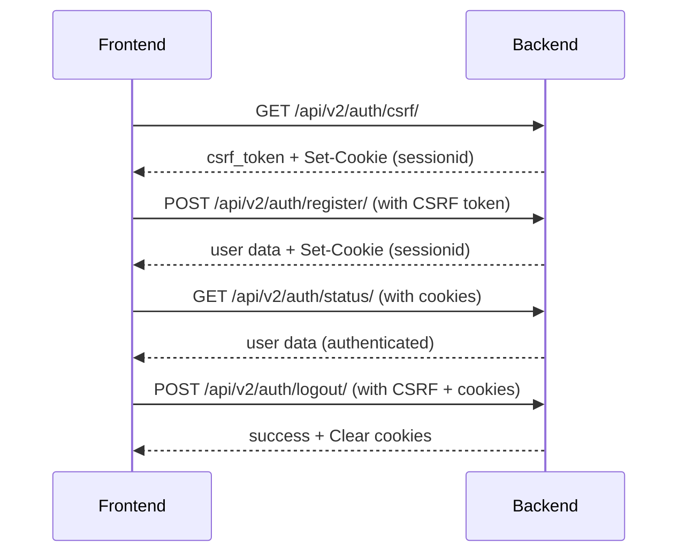

# API Contract: Auth V2 - Session-Based Authentication

**Version:** 2.0  
**Base URL:** `/api/v2/auth/`  
**Authentication Type:** Session-based (Django sessions with CSRF protection)  
**Target:** Next.js frontend with server-side session forwarding

---

## Overview

Auth V2 provides session-based authentication designed for Next.js applications that handle cookies server-side. Unlike V1 (JWT-based), V2 uses Django sessions with CSRF tokens for enhanced security.

### Key Differences from V1

| Feature | V1 (JWT) | V2 (Session) |
|---------|----------|--------------|
| Auth Method | JWT tokens in headers | HTTP-only cookies |
| Token Management | Client-side | Server-side (automatic) |
| CSRF Protection | Not required | Required for mutations |
| Best For | SPAs, mobile apps | Next.js SSR, traditional web |

---

## Authentication Flow



---

## Endpoints

### 1. Get CSRF Token

**Endpoint:** `GET /api/v2/auth/csrf/`  
**Auth Required:** No  
**Rate Limit:** None  

**Purpose:** Obtain a CSRF token before making any POST/PUT/PATCH/DELETE requests.

#### Response Success (200)

```json
{
  "success": true,
  "message": "CSRF token generated.",
  "data": {
    "csrf_token": "a8f3j2k9d8s7f6g5h4j3k2l1m0n9o8p7"
  }
}
```

#### Implementation Notes

- Call this endpoint first before any mutations
- The CSRF token is also set as a cookie (`csrftoken`)
- Include the token in `X-CSRFToken` header for all POST/PUT/PATCH/DELETE requests
- Session cookie (`sessionid`) is automatically set

#### Frontend Example (Next.js)

```typescript
// Server-side API route
export async function GET() {
  const response = await fetch(`${BACKEND_URL}/api/v2/auth/csrf/`, {
    credentials: 'include',
  });
  
  const data = await response.json();
  
  // Forward cookies to client
  return new Response(JSON.stringify(data), {
    headers: {
      'Set-Cookie': response.headers.get('set-cookie') || '',
    },
  });
}
```

---

### 2. Register

**Endpoint:** `POST /api/v2/auth/register/`  
**Auth Required:** No  
**Rate Limit:** 5 requests per hour per IP  

**Purpose:** Create a new user account and automatically log them in.

#### Request

**Headers:**
```
Content-Type: application/json
X-CSRFToken: <csrf_token_from_previous_request>
Cookie: sessionid=<session_id>; csrftoken=<csrf_token>
```

**Body:**
```json
{
  "email": "user@example.com",
  "phone": "+224620123456",
  "password": "StrongPass123!",
  "password_confirm": "StrongPass123!",
  "first_name": "Mamadou",
  "last_name": "Diallo"
}
```

**Field Requirements:**

| Field | Type | Required | Rules |
|-------|------|----------|-------|
| `email` | string/null | Conditional* | Valid email format, unique |
| `phone` | string/null | Conditional* | Format: `+[country][number]`, unique |
| `password` | string | Yes | Min 8 chars, 1 uppercase, 1 lowercase, 1 digit |
| `password_confirm` | string | Yes | Must match password |
| `first_name` | string | Yes | 2-50 characters |
| `last_name` | string | Yes | 2-50 characters |

\* At least one of `email` or `phone` must be provided.

#### Response Success (201)

```json
{
  "success": true,
  "message": "Account created successfully. Please verify your email or phone.",
  "data": {
    "user": {
      "id": "550e8400-e29b-41d4-a716-446655440000",
      "email": "user@example.com",
      "phone": "+224620123456",
      "first_name": "Mamadou",
      "last_name": "Diallo",
      "full_name": "Mamadou Diallo",
      "is_verified": false,
      "is_active": true,
      "security": {
        "score": 25,
        "level": "low"
      }
    },
    "csrf_token": "new_csrf_token_after_session_change",
    "requires_verification": true,
    "verification_sent_to": "email"
  }
}
```

**Response Headers:**
```
Set-Cookie: sessionid=<new_session_id>; HttpOnly; Secure; SameSite=Lax; Path=/
Set-Cookie: csrftoken=<new_csrf_token>; Path=/
```

#### Response Error (400) - Validation

```json
{
  "success": false,
  "message": "Validation error",
  "error": {
    "code": "VALIDATION_ERROR",
    "details": {
      "email": ["This email is already in use."],
      "password": ["Password must contain at least one uppercase letter."]
    }
  }
}
```

#### Response Error (429) - Rate Limit

```json
{
  "success": false,
  "message": "Too many registration attempts. Please try again later.",
  "error": {
    "code": "RATE_LIMIT_EXCEEDED",
    "details": {
      "retry_after": 3600
    }
  }
}
```

---

### 3. Login

**Endpoint:** `POST /api/v2/auth/login/`  
**Auth Required:** No  
**Rate Limit:** 5 requests per minute per IP  

**Purpose:** Authenticate a user and create a session.

#### Request

**Headers:**
```
Content-Type: application/json
X-CSRFToken: <csrf_token>
Cookie: sessionid=<session_id>; csrftoken=<csrf_token>
```

**Body:**
```json
{
  "identifier": "user@example.com",
  "password": "StrongPass123!"
}
```

**Field Requirements:**

| Field | Type | Required | Description |
|-------|------|----------|-------------|
| `identifier` | string | Yes | Email OR phone number |
| `password` | string | Yes | User's password |

#### Response Success (200)

```json
{
  "success": true,
  "message": "Login successful.",
  "data": {
    "user": {
      "id": "550e8400-e29b-41d4-a716-446655440000",
      "email": "user@example.com",
      "phone": "+224620123456",
      "first_name": "Mamadou",
      "last_name": "Diallo",
      "full_name": "Mamadou Diallo",
      "is_verified": true,
      "is_active": true,
      "security": {
        "score": 75,
        "level": "high"
      }
    },
    "csrf_token": "new_csrf_token_after_login",
    "requires_verification": false
  }
}
```

**Response Headers:**
```
Set-Cookie: sessionid=<new_session_id>; HttpOnly; Secure; SameSite=Lax; Path=/; Max-Age=1209600
Set-Cookie: csrftoken=<new_csrf_token>; Path=/
```

#### Response Error (401) - Invalid Credentials

```json
{
  "success": false,
  "message": "Invalid credentials.",
  "error": {
    "code": "AUTH_INVALID_CREDENTIALS",
    "details": null
  }
}
```

#### Response Error (423) - Account Locked

```json
{
  "success": false,
  "message": "Account temporarily locked due to multiple failed login attempts.",
  "error": {
    "code": "AUTH_ACCOUNT_LOCKED",
    "details": {
      "locked_until": "2026-02-02T15:30:00Z",
      "remaining_minutes": 25
    }
  }
}
```

---

### 4. Get Session Status

**Endpoint:** `GET /api/v2/auth/status/`  
**Auth Required:** Yes  
**Rate Limit:** None  

**Purpose:** Check if session is valid and get current user data.

#### Request

**Headers:**
```
Cookie: sessionid=<session_id>; csrftoken=<csrf_token>
```

#### Response Success (200)

```json
{
  "success": true,
  "message": "Session is active.",
  "data": {
    "user": {
      "id": "550e8400-e29b-41d4-a716-446655440000",
      "email": "user@example.com",
      "phone": "+224620123456",
      "first_name": "Mamadou",
      "last_name": "Diallo",
      "full_name": "Mamadou Diallo",
      "is_verified": true,
      "is_active": true,
      "security": {
        "score": 75,
        "level": "high"
      }
    },
    "authenticated": true
  }
}
```

#### Response Error (401) - Not Authenticated

```json
{
  "success": false,
  "message": "Authentication credentials were not provided.",
  "error": {
    "code": "NOT_AUTHENTICATED",
    "details": null
  }
}
```

#### Response Error (403) - Session Expired

```json
{
  "success": false,
  "message": "Session has expired. Please log in again.",
  "error": {
    "code": "SESSION_EXPIRED",
    "details": null
  }
}
```

---

### 5. Logout

**Endpoint:** `POST /api/v2/auth/logout/`  
**Auth Required:** Yes  
**Rate Limit:** None  

**Purpose:** Destroy the current session and log out the user.

#### Request

**Headers:**
```
Content-Type: application/json
X-CSRFToken: <csrf_token>
Cookie: sessionid=<session_id>; csrftoken=<csrf_token>
```

**Body:** (empty or `{}`)

#### Response Success (200)

```json
{
  "success": true,
  "message": "Logged out successfully."
}
```

**Response Headers:**
```
Set-Cookie: sessionid=; expires=Thu, 01 Jan 1970 00:00:00 GMT; Max-Age=0; Path=/
```

#### Response Error (401) - Not Authenticated

```json
{
  "success": false,
  "message": "Authentication credentials were not provided.",
  "error": {
    "code": "NOT_AUTHENTICATED",
    "details": null
  }
}
```

---

## Security Model

### Session Management

- **Session Duration:** 14 days (1,209,600 seconds)
- **Cookie Attributes:**
  - `HttpOnly`: Prevents JavaScript access
  - `Secure`: HTTPS only (production)
  - `SameSite=Lax`: CSRF protection
- **Storage:** Server-side in database or cache
- **Cleanup:** Expired sessions are automatically purged

### CSRF Protection

- **Required For:** All POST, PUT, PATCH, DELETE requests
- **Token Location:** 
  - Cookie: `csrftoken`
  - Header: `X-CSRFToken`
- **Validation:** Server validates token matches session
- **Rotation:** New token issued after login/register

### Rate Limiting

| Endpoint | Limit | Window |
|----------|-------|--------|
| `/csrf/` | None | - |
| `/register/` | 5 requests | 1 hour |
| `/login/` | 5 requests | 1 minute |
| `/status/` | None | - |
| `/logout/` | None | - |

### Security Score

User security score (0-100) is calculated based on:
- Email verification: +25 points
- Phone verification: +25 points
- Security questions setup: +25 points
- Backup phone added: +25 points

**Levels:**
- `low`: 0-33
- `medium`: 34-66
- `high`: 67-100

---

## Error Handling

### Standard Error Response Format

```json
{
  "success": false,
  "message": "Human-readable error message",
  "error": {
    "code": "ERROR_CODE",
    "details": {
      "field": ["Field-specific error messages"]
    }
  }
}
```

### Common Error Codes

| Code | Status | Description |
|------|--------|-------------|
| `VALIDATION_ERROR` | 400 | Input validation failed |
| `NOT_AUTHENTICATED` | 401 | No valid session |
| `AUTH_INVALID_CREDENTIALS` | 401 | Wrong email/phone/password |
| `AUTH_ACCOUNT_LOCKED` | 423 | Too many failed attempts |
| `CSRF_TOKEN_MISSING` | 403 | CSRF token not provided |
| `CSRF_TOKEN_INVALID` | 403 | CSRF token doesn't match |
| `SESSION_EXPIRED` | 403 | Session has expired |
| `RATE_LIMIT_EXCEEDED` | 429 | Too many requests |
| `SERVER_ERROR` | 500 | Internal server error |

---

## Frontend Integration Guide

### Next.js 14+ (App Router)

#### 1. Create API Route Handler

```typescript
// app/api/auth/[...path]/route.ts
import { NextRequest, NextResponse } from 'next/server';

const BACKEND_URL = process.env.BACKEND_URL || 'http://localhost:8000';

export async function GET(
  request: NextRequest,
  { params }: { params: { path: string[] } }
) {
  const path = params.path.join('/');
  
  // Forward cookies from client to backend
  const cookies = request.headers.get('cookie') || '';
  
  const response = await fetch(`${BACKEND_URL}/api/v2/auth/${path}/`, {
    method: 'GET',
    headers: {
      'Cookie': cookies,
    },
    credentials: 'include',
  });
  
  const data = await response.json();
  
  // Forward set-cookie headers back to client
  const setCookie = response.headers.get('set-cookie');
  const headers = new Headers();
  
  if (setCookie) {
    headers.set('set-cookie', setCookie);
  }
  
  return NextResponse.json(data, {
    status: response.status,
    headers,
  });
}

export async function POST(
  request: NextRequest,
  { params }: { params: { path: string[] } }
) {
  const path = params.path.join('/');
  const body = await request.json();
  
  // Get cookies including CSRF token
  const cookies = request.headers.get('cookie') || '';
  const csrfToken = request.cookies.get('csrftoken')?.value || '';
  
  const response = await fetch(`${BACKEND_URL}/api/v2/auth/${path}/`, {
    method: 'POST',
    headers: {
      'Content-Type': 'application/json',
      'Cookie': cookies,
      'X-CSRFToken': csrfToken,
    },
    body: JSON.stringify(body),
    credentials: 'include',
  });
  
  const data = await response.json();
  
  // Forward set-cookie headers
  const setCookie = response.headers.get('set-cookie');
  const headers = new Headers();
  
  if (setCookie) {
    headers.set('set-cookie', setCookie);
  }
  
  return NextResponse.json(data, {
    status: response.status,
    headers,
  });
}
```

#### 2. Client-Side Hook

```typescript
// hooks/useAuth.ts
import { useState, useEffect } from 'react';

interface User {
  id: string;
  email: string;
  phone: string;
  first_name: string;
  last_name: string;
  full_name: string;
  is_verified: boolean;
  is_active: boolean;
  security: {
    score: number;
    level: 'low' | 'medium' | 'high';
  };
}

export function useAuth() {
  const [user, setUser] = useState<User | null>(null);
  const [loading, setLoading] = useState(true);
  
  useEffect(() => {
    checkAuth();
  }, []);
  
  async function checkAuth() {
    try {
      const response = await fetch('/api/auth/status');
      const data = await response.json();
      
      if (data.success) {
        setUser(data.data.user);
      } else {
        setUser(null);
      }
    } catch (error) {
      console.error('Auth check failed:', error);
      setUser(null);
    } finally {
      setLoading(false);
    }
  }
  
  async function register(formData: {
    email?: string;
    phone?: string;
    password: string;
    password_confirm: string;
    first_name: string;
    last_name: string;
  }) {
    // Get CSRF token first
    await fetch('/api/auth/csrf');
    
    const response = await fetch('/api/auth/register', {
      method: 'POST',
      headers: { 'Content-Type': 'application/json' },
      body: JSON.stringify(formData),
    });
    
    const data = await response.json();
    
    if (data.success) {
      setUser(data.data.user);
      return { success: true, data: data.data };
    }
    
    return { success: false, error: data.error };
  }
  
  async function login(identifier: string, password: string) {
    // Get CSRF token first
    await fetch('/api/auth/csrf');
    
    const response = await fetch('/api/auth/login', {
      method: 'POST',
      headers: { 'Content-Type': 'application/json' },
      body: JSON.stringify({ identifier, password }),
    });
    
    const data = await response.json();
    
    if (data.success) {
      setUser(data.data.user);
      return { success: true, data: data.data };
    }
    
    return { success: false, error: data.error };
  }
  
  async function logout() {
    const response = await fetch('/api/auth/logout', {
      method: 'POST',
    });
    
    const data = await response.json();
    
    if (data.success) {
      setUser(null);
    }
    
    return data;
  }
  
  return {
    user,
    loading,
    isAuthenticated: !!user,
    register,
    login,
    logout,
    refreshAuth: checkAuth,
  };
}
```

#### 3. Protected Route Component

```typescript
// components/ProtectedRoute.tsx
'use client';

import { useEffect } from 'react';
import { useRouter } from 'next/navigation';
import { useAuth } from '@/hooks/useAuth';

export function ProtectedRoute({ children }: { children: React.ReactNode }) {
  const { isAuthenticated, loading } = useAuth();
  const router = useRouter();
  
  useEffect(() => {
    if (!loading && !isAuthenticated) {
      router.push('/login');
    }
  }, [isAuthenticated, loading, router]);
  
  if (loading) {
    return <div>Loading...</div>;
  }
  
  if (!isAuthenticated) {
    return null;
  }
  
  return <>{children}</>;
}
```

---

## Testing

### cURL Examples

#### Get CSRF Token
```bash
curl -X GET http://localhost:8000/api/v2/auth/csrf/ \
  -c cookies.txt \
  -v
```

#### Register
```bash
curl -X POST http://localhost:8000/api/v2/auth/register/ \
  -H "Content-Type: application/json" \
  -H "X-CSRFToken: <token_from_previous_request>" \
  -b cookies.txt \
  -c cookies.txt \
  -d '{
    "email": "test@example.com",
    "password": "TestPass123!",
    "password_confirm": "TestPass123!",
    "first_name": "Test",
    "last_name": "User"
  }'
```

#### Login
```bash
curl -X POST http://localhost:8000/api/v2/auth/login/ \
  -H "Content-Type: application/json" \
  -H "X-CSRFToken: <token>" \
  -b cookies.txt \
  -c cookies.txt \
  -d '{
    "identifier": "test@example.com",
    "password": "TestPass123!"
  }'
```

#### Check Status
```bash
curl -X GET http://localhost:8000/api/v2/auth/status/ \
  -b cookies.txt \
  -v
```

#### Logout
```bash
curl -X POST http://localhost:8000/api/v2/auth/logout/ \
  -H "X-CSRFToken: <token>" \
  -b cookies.txt \
  -c cookies.txt
```

---

## FAQ

### When should I use V2 instead of V1?

Use V2 if:
- Building a Next.js app with server-side rendering
- Want enhanced security with HTTP-only cookies
- Frontend doesn't need to manage tokens
- Building a traditional web app

Use V1 if:
- Building a mobile app
- Need stateless authentication
- Building a pure SPA without SSR
- Need cross-domain authentication

### How do I handle session expiry?

Monitor for 401/403 responses and redirect to login:

```typescript
async function apiCall(url: string, options?: RequestInit) {
  const response = await fetch(url, options);
  const data = await response.json();
  
  if (response.status === 401 || response.status === 403) {
    // Redirect to login
    window.location.href = '/login';
    throw new Error('Session expired');
  }
  
  return data;
}
```

### Do I need to refresh sessions?

No. Django sessions are automatically extended on each request. The default session duration is 14 days.

### Can I use V1 and V2 simultaneously?

Yes, but not for the same user. Choose one authentication method per client type.

### How do I test authentication locally?

1. Start the Django server: `python manage.py runserver`
2. Use the cURL examples above or Postman
3. Make sure to save and send cookies between requests

### What about CORS?

Configure in `config/settings.py`:

```python
CORS_ALLOWED_ORIGINS = [
    "http://localhost:3000",  # Next.js dev server
]
CORS_ALLOW_CREDENTIALS = True
CSRF_TRUSTED_ORIGINS = [
    "http://localhost:3000",
]
```

---

## Changelog

### Version 2.0 (Current)
- Initial release of session-based authentication
- CSRF protection implementation
- Next.js integration guide
- Security score in user response

---

## Support

For questions or issues:
1. Check this contract first
2. Review implementation in `domain/account/api/views/auth_v2.py`
3. Test with provided cURL examples
4. Contact backend team

**Last Updated:** February 2, 2026
